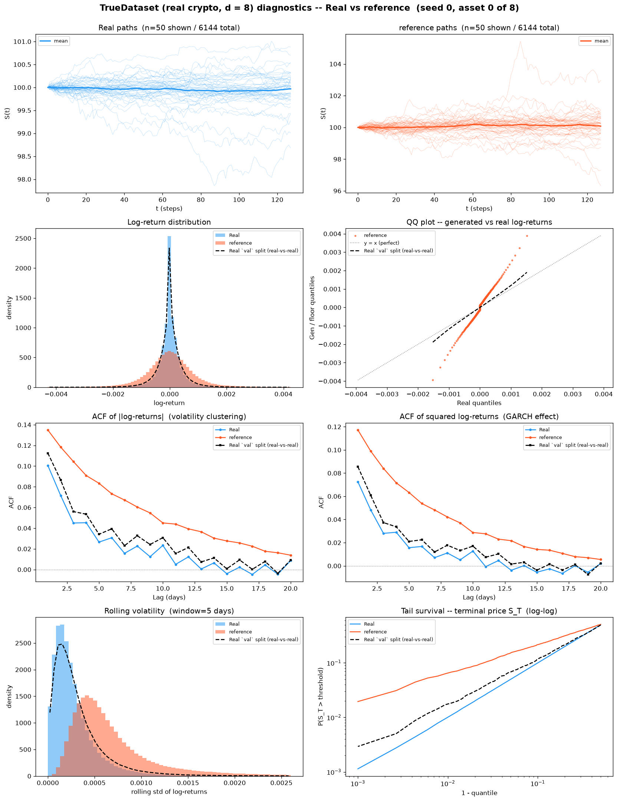
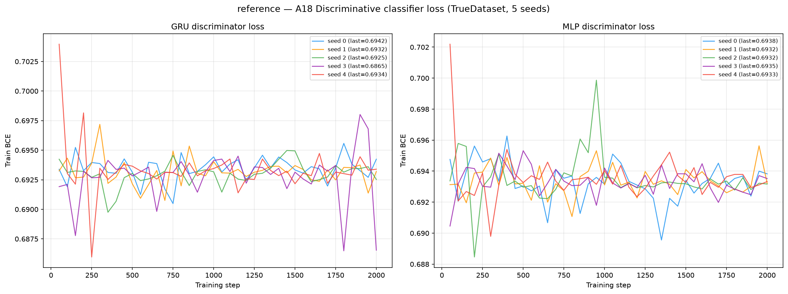
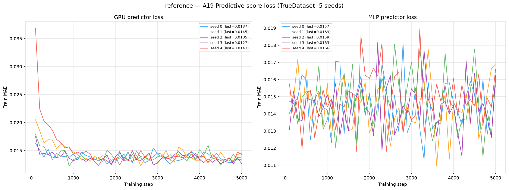

# The Reference SDE on TrueDataset — real crypto spot, d = 8

**σ<sup>ref</sup> — the frozen reference diffusion of Deep-MKV-TS Algorithm 1**
(El Boustany, Basseras, Mekkaoui, Alouadi, Hafsi & Pham), sampled with the neural
control switched **off**, on 6 144 paths of 8 correlated crypto spot series
(BTC, ETH, BNB, SOL, XRP, DOGE, ADA, LINK), 30-second bars, seq\_len = 128,
built from Binance public 1-second klines over 2022-07 → 2026-07.

This is the real-data counterpart of
[`../../HestonMultiAsset/reference/`](../../HestonMultiAsset/reference/README.md), and it is
**not a competing generator**. It is the *starting line*. Algorithm 1 takes a pre-fitted
parametric diffusion σ<sup>ref</sup> and learns a neural control on top of it; this folder
scores σ<sup>ref</sup> **alone**, so [`../Deep-MKV-TS/`](../Deep-MKV-TS)'s numbers can be split
into "what the reference SDE already gave us" and "what the control actually bought".

| Folder | Samples from | Reads as |
|--------|--------------|----------|
| [`../real_floor/`](../real_floor) | 3 **held-out real splits** | what a *perfect memoriser of the training era* scores on the test era — **not** a target |
| **`reference/`** *(this page)* | the **fitted** σ<sup>ref</sup> | Deep-MKV-TS **before its first gradient step** |
| [`../Deep-MKV-TS/`](../Deep-MKV-TS) | the **trained** control | reference **minus** this = what Algorithm 1 bought |

> **One bracket is missing, and it changes how this page must be read.** On Heston the
> reference sits between an independent draw from the *true* SDE and the trained method — two
> sides, so "did the control help" and "how much is left" both have answers. **A real market has
> no law to re-draw from**, so there is no perfect-recovery floor here; `../real_floor/` is a
> memoriser's score, not a floor a generator ought to reach (guideline §6.1). The attribution
> argument on this dataset therefore runs entirely through the **paired**
> reference-vs-Deep-MKV-TS difference at matched generation seeds — which is why the generation
> seeds are imported from `Deep-MKV-TS/code/generate_bank_true.py` rather than redefined.

The model is **built but never fitted**. All 56136 parameters are constructed exactly as
`train_true.py` constructs them, and then **0 gradient steps** are taken. Algorithm 1
zero-initialises the final layer of both output heads — weight *and* bias — so `Ẑ ≡ 0` for
every hidden state whatever the GRU beneath computes, the control

$$\Theta = \eta\,(\sigma^{\mathrm{ref}})^{-1} + \hat{Z}/\sqrt{\Delta t}$$

reduces to $\eta\,(\sigma^{\mathrm{ref}})^{-1}$, and the sampler integrates
σ<sup>ref</sup> itself. All 4 head tensors measured `max|·| = 0`, verified at generation time —
`code/generate_reference_true.py` refuses to write a bank if any is non-zero, so the central
claim of this page is **enforced rather than asserted** (per-seed record in
`generated_paths/seed_{i}/metadata.json` under `zhat_head_max_abs`).

See [`code/README.md`](code/README.md) for the five guideline §2 answers and implementation
notes, [`weights/README.md`](weights/README.md) for the fitted coefficients and their
provenance, and [`../truedatasetguideline.md`](../truedatasetguideline.md) for the build, the
five-split contract, and what the reference column does and does not mean.

> **Hyperparameters: none were chosen for this folder.** σ<sup>ref</sup> carries **25
> fitted numbers in total** — 7 covariance-diagonal, 7 off-diagonal, 5
> drift, 4 half-lives and 2 mixing weights — plus the spectral clip bounds
> `σ_min=0.001`, `σ_max=5.0`. They come from a **300-step Gaussian-NLL fit on the
> training split only** (`true_S_6144x128x8.npy`, internal 80/20
> calibration/validation split, lr=0.01), `fitted_at` **2026-08-27T07:24:25**, final calibration NLL
> **-1.444873**, validation NLL **-1.426201**. Nothing else is tuned: no learning rate,
> no ridge λ, no checkpoint selection, no early stopping — because there is no training. That
> is 25 numbers against **251 658 training values per number**.
> **`σ_max` is 5.0 here and 0.6 on Heston, and that is not a free choice.** The clip is in
> annualised volatility units and this panel's `dt` is 9.512938e-07 years against Heston's 1/252, so
> `1/√dt` is 64.6× larger and the same per-step move maps to a far larger annualised number. The
> ceiling binds on **nan%** of eigenvalues and the floor on **nan%**,
> with the spectrum's p99 at **nan** — a guard rail, not the model.
> **The fit is gated on a scale-free test.** Heston's `validation_nll > -9.0` freeze guard was a
> Heston-scale number and would have rejected every fit on this panel, so it was **deleted, not
> re-tuned**: the fit is rejected unless it beats the i.i.d. Gaussian baseline
> (nan), which it does by **nan nats**. That gain is the whole claim that this
> reference SDE carries structure rather than fitting noise.

---

## Metrics A1-A32 + B, mean ± std across 5 seeds

> All metrics on **log-returns** $r_t = \log(S_{t+1}/S_t)$ unless noted. A26 uses price increments $\Delta S_t$.
> Rows marked *(native d=8)* are evaluated **once** on the full `(N, T, 8)` tensor; every other
> row is computed on each of the 8 univariate slices and reported as the **mean over assets**
> (per-asset breakdown in [`metrics_per_asset.csv`](metrics_per_asset.csv)).
> **A33-A34 are absent, not failed** — the one structural difference from the Heston twin of
> this page, which does carry them. They score the generated path against the dataset's *latent
> variance* path; a real market has none, so `compute_all_multiasset.py` skips them rather than
> fabricating a proxy.

| Metric | Mean ± Std | Seed 0 | Seed 1 | Seed 2 | Seed 3 | Seed 4 | Real-vs-real floor |
|---|---|---|---|---|---|---|---|
| **Fat Tail** | | | | | | | |
| A1 Kurtosis Error ↓ | 29.75 ± 0.04771 | 29.72 | 29.84 | 29.75 | 29.75 | 29.71 | 259.6 |
| A2 \|r\| q95 Error ↓ | 7.02e-04 ± 1.23e-05 | 7.21e-04 | 7.05e-04 | 6.83e-04 | 7.02e-04 | 6.97e-04 | 1.85e-04 |
| A3 \|r\| q99 Error ↓ | 0.001639 ± 2.98e-05 | 0.001684 | 0.001649 | 0.001591 | 0.001631 | 0.001641 | 4.53e-04 |
| A4 Tail QQ Error ↓ | 7.17e-04 ± 1.22e-05 | 7.37e-04 | 7.21e-04 | 6.99e-04 | 7.18e-04 | 7.13e-04 | 1.94e-04 |
| A5 Hill Tail Index Error ↓ | 104.5 ± 2.729 | 108.7 | 102.7 | 100.8 | 104.2 | 106 | 39.99 |
| **Distribution** | | | | | | | |
| A6 Path MMD² ↓ *(native d=8)* | 0.007803 ± 5.30e-04 | 0.008451 | 0.007837 | 0.006881 | 0.00815 | 0.007697 | 0.00108 |
| A7 Terminal MMD² ↓ *(native d=8)* | 0.01418 ± 0.001105 | 0.01533 | 0.01542 | 0.01253 | 0.01414 | 0.01346 | 0.00199 |
| A8 Increment MMD² ↓ *(native d=8)* | 5.06e-05 ± 1.93e-06 | 5.10e-05 | 5.09e-05 | 4.71e-05 | 5.30e-05 | 5.11e-05 | 1.71e-05 |
| A9 Volatility MMD ↓ *(native d=8)* | 0.04086 ± 0.002798 | 0.04445 | 0.042 | 0.03588 | 0.04081 | 0.04118 | 0.003092 |
| A10 Terminal SWD ↓ *(native d=8)* | 0.2732 ± 0.02104 | 0.2999 | 0.2833 | 0.2358 | 0.2747 | 0.2725 | 0.09816 |
| A11 Path SWD ↓ *(native d=8)* | 0.1358 ± 0.005041 | 0.1381 | 0.1359 | 0.1263 | 0.1411 | 0.1376 | 0.06425 |
| A12 RV Law Loss ↓ | 0.01989 ± 3.56e-04 | 0.02047 | 0.01997 | 0.01935 | 0.01987 | 0.01981 | 0.00733 |
| A13 Mean Path RMSE ↓ | 0.01213 ± 0.004245 | 0.02003 | 0.009581 | 0.008101 | 0.0129 | 0.01003 | 0.01055 |
| A14 KS Log-returns ↓ | 0.124 ± 4.70e-04 | 0.1248 | 0.124 | 0.1236 | 0.1239 | 0.1235 | 0.06536 |
| A15 Skewness Error ↓ | 0.244 ± 0.008608 | 0.2421 | 0.2355 | 0.2392 | 0.2427 | 0.2604 | 1.365 |
| A16 QQ RMSE (300-pt) ↓ | 3.36e-04 ± 4.62e-06 | 3.44e-04 | 3.37e-04 | 3.29e-04 | 3.36e-04 | 3.34e-04 | 1.08e-04 |
| A17 Terminal Price KS ↓ | 0.05557 ± 0.002249 | 0.05955 | 0.05581 | 0.05275 | 0.05438 | 0.05534 | 0.032 |
| **Adversarial** | | | | | | | |
| A18 Disc Score GRU ↓ *(native d=8)* | 0.05004 ± 0.08692 | 0.008137 | 0.006916 | 8.14e-04 | 0.2238 | 0.01058 | 0.01044 |
| A18 Disc Score MLP ↓ *(native d=8)* | 0.008462 ± 0.003578 | 0.01221 | 0.007323 | 0.01058 | 0.01017 | 0.002034 | 0.003797 |
| **Predictive** | | | | | | | |
| A19 Pred Score GRU ↓ | 0.003565 ± 1.01e-05 | 0.003551 | 0.003572 | 0.003556 | 0.003569 | 0.003577 | 0.003637 |
| A19 Pred Score MLP ↓ | 0.003918 ± 8.36e-05 | 0.004043 | 0.00384 | 0.003978 | 0.003819 | 0.003908 | 0.003776 |
| **Temporal** | | | | | | | |
| A20 Covariance Error ↓ *(native d=8)* | 2.69 ± 0.1495 | 2.921 | 2.658 | 2.458 | 2.667 | 2.744 | 1.157 |
| A21 ACF \|r\| Error (lags) ↓ | 0.05079 ± 0.001052 | 0.05238 | 0.05134 | 0.0492 | 0.05041 | 0.05063 | 0.009538 |
| A22 ACF r² Error (lags) ↓ | 0.04415 ± 7.90e-04 | 0.04539 | 0.04451 | 0.04304 | 0.04366 | 0.04413 | 0.006465 |
| A23 ACF \|r\| Lag-1 Error ↓ | 0.05698 ± 9.33e-04 | 0.05854 | 0.05711 | 0.05565 | 0.05696 | 0.05661 | 0.0123 |
| A24 ACF r² Lag-1 Error ↓ | 0.0548 ± 7.90e-04 | 0.05619 | 0.05477 | 0.05378 | 0.05483 | 0.05444 | 0.008313 |
| **Vol** | | | | | | | |
| A25 Mean RMSE ↓ *(native d=8)* | 0.0582 ± 0.02048 | 0.09383 | 0.03562 | 0.04217 | 0.05438 | 0.06498 | 0.04728 |
| A26 Return Std Error ↓ | 0.03731 ± 5.90e-04 | 0.03829 | 0.03737 | 0.03643 | 0.0373 | 0.03717 | 0.01284 |
| A27 Log-Return Std Error ↓ | 3.72e-04 ± 5.66e-06 | 3.81e-04 | 3.73e-04 | 3.64e-04 | 3.72e-04 | 3.70e-04 | 1.28e-04 |
| A28 Kurtosis Ratio (→ 1) | 3.323 ± 0.0158 | 3.301 | 3.329 | 3.336 | 3.342 | 3.309 | 0.4156 |
| A29 Sigma Mean Error ↓ | 0.005054 ± 6.95e-05 | 0.005164 | 0.005071 | 0.004953 | 0.005065 | 0.005016 | 0.00146 |
| A30 Cross-Sect. Vol Path RMSE ↓ | 0.256 ± 0.009015 | 0.2697 | 0.2565 | 0.2429 | 0.2506 | 0.2602 | 0.09316 |
| A31 Rolling Vol KS (w=5) ↓ | 0.2736 ± 8.63e-04 | 0.2743 | 0.2736 | 0.2728 | 0.2748 | 0.2725 | 0.1196 |
| A32 Vol-of-Vol Error ↓ | 2.26e-04 ± 3.81e-06 | 2.32e-04 | 2.27e-04 | 2.20e-04 | 2.25e-04 | 2.25e-04 | 1.04e-04 |

> **Convention:** ↓ lower is better; ↑ higher is better; no arrow = no monotone direction. A28 Kurtosis Ratio: perfect = 1.0.
> **Headline:** **3 of the 34 A-metric rows sit at or below the real-vs-real column with the control switched off** — A1 Kurtosis Error, A15 Skewness Error, A19 Pred Score GRU. The largest gaps are **A9 Volatility MMD** (0.04086 vs floor 0.003092, 13.2×); **A6 Path MMD²** (0.007803 vs floor 0.00108, 7.2×); **A7 Terminal MMD²** (0.01418 vs floor 0.00199, 7.1×); **A22 ACF r² Error (lags)** (0.04415 vs floor 0.006465, 6.8×). **Read neither as a win nor as a failure.** See the column caption below: this column is a memoriser's score on a later era, so beating it is not evidence of quality and losing to it is not evidence of a defect. Cross-method win-counts belong in the dataset-level comparison table, not here.
> **What the "Real-vs-real floor" column is — read this before quoting it.** On Heston the floor is an *independent draw from the true SDE*: a genuine second sample of the data-generating law. **A real market has no law to re-draw from.** The column here is instead 3 **held-out real splits** — `train`, `val`, `valdisc` — pushed through the metric pipeline *as if they were generated banks* and scored against `test`, with byte-identical code. Three consequences you must not forget:
> 1. It is **not** a floor a generator ought to reach. It is the score a **perfect memoriser of the training era** achieves on the test era.
> 2. The build is **holdout-era** (train ends 2024-11-23, test starts 2025-02-10, 45.5-day embargo), so part of the distance is a genuine **regime change**, not finite-sample noise. Annualised vol falls from train to test on every asset (BTC 0.498 → 0.429, SOL 1.039 → 0.733). A generator that matched the *training* law perfectly would still score badly here — correctly so.
> 3. The `disc` split is **excluded on purpose**: it is the discriminator's real side, so using it as a fake bank would drive A18 to 0 by construction and manufacture an unreachable floor.
> **How to read this page against [`../Deep-MKV-TS/`](../Deep-MKV-TS):** on any row, *(reference − Deep-MKV-TS)* is the control's contribution. A row where Deep-MKV-TS scores **worse** than this page is a row where Algorithm 1 actively damaged a working reference — the single most informative failure this benchmark can surface, and completely invisible without a reference column. Since there is no true-law floor on this dataset, *(Deep-MKV-TS − floor)* is **not** "what remains unsolved" and must not be read that way.
> **Pairing:** generation seeds are `90000 + i`, **imported** from `Deep-MKV-TS/code/generate_bank_true.py` rather than redefined, so each reference bank draws the **same Brownian stream** as the corresponding Deep-MKV-TS bank. The difference between the two pages is therefore paired seed by seed, which removes simulation noise from the comparison instead of averaging over it.
> **A1-A5**: fat-tail block — kurtosis error, tail quantile / QQ errors on |log-returns|, Hill tail index. **A6-A11** *(native d=8)*: path-kernel distances on the full 8-dimensional tensor (MMD² on paths / terminal / increments / realized-vol; sliced-Wasserstein on terminal & full paths), the rows where a multivariate generalisation is genuinely meaningful.
> **A12-A17**: distribution block, per asset then averaged. **A18** *(native d=8)*: discriminative classifier on all 8 channels at once, score = |accuracy − 0.5|, trained real=`disc` vs fake=generated. **A19**: TSTR MAE, deliberately **per-asset** — `predictive_score.py::_train_gru` targets `data_t[idx, 1:, :1]`, i.e. only the first feature, so a native run would silently report an asset-0-only number under a multi-asset name.
> **A20** *(native d=8)*: error on the full terminal covariance matrix — the row that tests whether the 28 realised cross-asset correlations (mean 0.609, range 0.515-0.801) survived generation, and the row σ<sup>ref</sup>'s 7 off-diagonal coefficients exist to capture. **A21-A24**: ACF |r|/r² errors. **A25** *(native d=8)*: mean RMSE across all assets jointly. **A26-A32**: volatility block. **A28** kurtosis ratio: perfect = 1.0.

---

## B, Curve-Shape Metrics, mean ± std across 5 seeds

Each stylised-fact plot yields a **curve** L (a list of values), not a scalar. The curve is
computed **per asset and averaged over the 8 assets** *before* the combination below, so the
combination rules stay byte-identical to the Heston tree. For the real data (L_r) and generated
data (L_g) we build three lists, the curve L, its first finite difference L' (der), and its
second finite difference L'' (sec\_der), then combine the three sub-scores into **one number
per plot**:

- **MSE row**: for each list, dᵢ = mean((L_r − L_g)²). Reported mean = the **mean of the three sub-scores** (funct + der + sec\_der)/3; std = the sample std of that per-seed combined score across the 5 seeds. The **MSE row decides the cross-method winner**.
- **% err row**: for each list, dᵢ = mean(|L_g − L_r| / (|L_r| + 1e-6)) × 100, a proper MAPE. Reported value = the **function-level MAPE on the curve L itself**; the derivative / 2nd-derivative MAPE is **excluded** because diff(L)/diff2(L) have near-zero true values, so their relative error explodes into meaningless 10⁴-% figures.
- **NRMSE row**: sqrt(mean((L_g − L_r)²)) / (max|L_r| − min|L_r| + 1e-12) × 100 on the curve L **only (funct-only)**.
- **CVaR₉₀ / CVaR₉₅ rows**: tail-averaged pointwise curve error (Expected Shortfall) on the curve L **only (funct-only)**. Pointwise error eₜ = |L_g(t) − L_r(t)|; for q ∈ {0.90, 0.95}, CVaR_q = mean(eₜ for eₜ ≥ the q-th percentile of eₜ), then range-normalized like NRMSE.

All ↓ lower is better. The reference column is the same **real-vs-real** construction as above, with the same three caveats.

| Plot | Measure | Mean ± Std | Seed 0 | Seed 1 | Seed 2 | Seed 3 | Seed 4 | Real-vs-real floor |
|---|---|---|---|---|---|---|---|---|
| **Path comparison** *(50×50 path-cloud)* | grid_tvd 50×50 (%) ↓ | 8.036% ± 0.232% | 8.313% | 7.714% | 7.818% | 8.111% | 8.225% | 3.683% |
| **Log-return histogram** | MSE | 3.649e+05 ± 392.2 | 3.651e+05 | 3.646e+05 | 3.656e+05 | 3.648e+05 | 3.645e+05 | 3.806e+05 |
|  | % err | 1.546e+08% ± 4.377e+05% | 1.549e+08% | 1.553e+08% | 1.541e+08% | 1.544e+08% | 1.544e+08% | 1.765e+07% |
|  | NRMSE | 9.217% ± 0.01451% | 9.238% | 9.216% | 9.209% | 9.228% | 9.196% | 10.24% |
|  | CVaR₉₀ | 19.28% ± 0.04214% | 19.35% | 19.28% | 19.26% | 19.31% | 19.22% | 24.39% |
|  | CVaR₉₅ | 29.56% ± 0.05054% | 29.64% | 29.53% | 29.54% | 29.59% | 29.49% | 35.63% |
| **QQ plot** | MSE | 5.75e-08 ± 1.36e-09 | 5.95e-08 | 5.80e-08 | 5.53e-08 | 5.71e-08 | 5.76e-08 | 7.92e-09 |
|  | % err | 1247% ± 3.872% | 1252% | 1245% | 1244% | 1251% | 1243% | 326.6% |
|  | NRMSE | 17.95% ± 0.223% | 18.29% | 18.02% | 17.59% | 17.92% | 17.92% | 5.085% |
|  | CVaR₉₀ | 21.33% ± 0.2999% | 21.77% | 21.43% | 20.84% | 21.28% | 21.31% | 5.59% |
|  | CVaR₉₅ | 28.33% ± 0.4515% | 29% | 28.47% | 27.59% | 28.21% | 28.39% | 7.278% |
| **ACF \|r\|** | MSE | 8.69e-04 ± 3.44e-05 | 9.17e-04 | 8.97e-04 | 8.18e-04 | 8.55e-04 | 8.60e-04 | 5.48e-05 |
|  | % err | 1081% ± 26.6% | 1117% | 1099% | 1039% | 1070% | 1078% | 237.1% |
|  | NRMSE | 60.94% ± 1.325% | 62.75% | 61.92% | 58.88% | 60.7% | 60.46% | 11.29% |
|  | CVaR₉₀ | 81.93% ± 1.533% | 84.12% | 83.09% | 79.72% | 81.54% | 81.19% | 17.29% |
|  | CVaR₉₅ | 84.53% ± 1.49% | 86.61% | 85.67% | 82.32% | 84.21% | 83.83% | 18.72% |
| **ACF r²** | MSE | 5.33e-04 ± 2.16e-05 | 5.62e-04 | 5.51e-04 | 5.01e-04 | 5.21e-04 | 5.29e-04 | 3.14e-05 |
|  | % err | 2641% ± 171.9% | 2665% | 2886% | 2431% | 2755% | 2467% | 321.1% |
|  | NRMSE | 58.01% ± 1.069% | 59.52% | 58.79% | 56.4% | 57.63% | 57.71% | 9.25% |
|  | CVaR₉₀ | 82.8% ± 1.318% | 84.75% | 83.89% | 81.18% | 82.24% | 81.92% | 14.23% |
|  | CVaR₉₅ | 85.07% ± 1.299% | 86.8% | 86.14% | 83.11% | 84.83% | 84.46% | 15.52% |
| **Rolling vol histogram** | MSE | 1.018e+05 ± 407.8 | 1.021e+05 | 1.02e+05 | 1.015e+05 | 1.022e+05 | 1.012e+05 | 3.897e+04 |
|  | % err | 155.9% ± 1.607% | 158.6% | 156.1% | 153.9% | 156.5% | 154.6% | 42.82% |
|  | NRMSE | 19.36% ± 0.05128% | 19.39% | 19.38% | 19.32% | 19.44% | 19.29% | 10% |
|  | CVaR₉₀ | 49.95% ± 0.1224% | 50.05% | 50% | 49.82% | 50.09% | 49.79% | 25.83% |
|  | CVaR₉₅ | 57.38% ± 0.1217% | 57.41% | 57.43% | 57.35% | 57.52% | 57.16% | 31.15% |
| **Tail survival** | MSE | 0.01113 ± 6.10e-05 | 0.01122 | 0.01115 | 0.01107 | 0.01116 | 0.01106 | 0.002323 |
|  | % err | 58.06% ± 0.4239% | 58.73% | 58.16% | 57.5% | 58.2% | 57.73% | 17.91% |
|  | NRMSE | 20.04% ± 0.06696% | 20.13% | 20.05% | 19.97% | 20.08% | 19.96% | 8.573% |
|  | CVaR₉₀ | 29.15% ± 0.08693% | 29.28% | 29.17% | 29.07% | 29.19% | 29.04% | 14.21% |
|  | CVaR₉₅ | 29.24% ± 0.08628% | 29.37% | 29.26% | 29.16% | 29.28% | 29.13% | 14.69% |

> **Headline:** **1 of the 6 B plots** sit at or below the real-vs-real column on the deciding MSE row **with the control switched off**: Log-return histogram.
> **Cross-seed stability is the useful column here.** There is no gradient descent, no checkpoint selection and no early stopping in this folder, so the *only* seed-to-seed variation is the Euler–Maruyama draw itself. The std columns therefore measure **pure simulation noise at N = 6 144**, which makes them a yardstick rather than a footnote: a trained method whose std is materially larger than this page's is unstable for reasons that are **not** sampling noise.

---

## Memorisation check

Guideline §9 makes this section mandatory for every method on this dataset, and
§6.1.2 explains why: on the Heston tree a score sinking below the floor is itself
the copying alarm, and **here it is not** — the floor column is a *memoriser's*
score, not a target — so this ratio is the only guard there is.

**On this page it is a calibration, not a test.** σ<sup>ref</sup> carries **25 fitted
numbers** against ~6.3M training values, and its neural control is
verified to be exactly zero before a single path is written. Memorisation is
not merely unlikely here, it is arithmetically impossible. So whatever the
estimator returns **is its reading for a generator that certainly did not
memorise** — the null the SBTS and CSDI columns need in order to mean anything.

```
NNratio = median NN(generated -> train) / median NN(val -> train)
          log-returns, flattened to (T-1)*d = 1016 dims
```

| Seed | median NN(gen → train) | NNratio (vs `val`) | Exact duplicates |
|------|-----------------------:|-------------------:|-----------------:|
| 0 | 0.028916 | 1.5264 | 0 |
| 1 | 0.028734 | 1.5169 | 0 |
| 2 | 0.028321 | 1.4950 | 0 |
| 3 | 0.028671 | 1.5135 | 0 |
| 4 | 0.028323 | 1.4951 | 0 |
| **mean** | **0.028593** | **1.5094 ± 0.0124** | **0** |

**NNratio = 1.509 ± 0.012**, against a real-vs-real band of **0.932–1.000**. It sits **above** the band — generated paths are *further* from the training set than real held-out data is, which is the opposite failure from copying.

The band is not a chosen tolerance and it is not this method's to set: its
endpoints are what the **real splits** score against each other,
`median NN(test → train) / median NN(val → train)` = **0.932**, and `val`
against itself = **1.000**. Zero free parameters, the same construction as the
floor column. Because both endpoints are distances between real splits they
belong to the dataset build rather than to any generator, so the numerator is
read from [`../SBTS/losses/memorisation.json`](../SBTS/losses/memorisation.json)
rather than recomputed — this folder's `measure_memorisation.py` scores only the
`val` arm.
The read is checked, not assumed: that file's `median_nn_heldout` (0.018943) is
bit-identical to this folder's, which is what makes the two estimators the
same code on the same data.

> **The denominator is `val`, not `test`** (guideline §9.1). `val` is the same era
> as `train`; `test` sits behind a 45.5-day embargo in a later regime where
> annualised vol has **fallen** on 6 of 8 assets, so every distance contracts and a
> `test` denominator is *smaller*. A smaller denominator inflates the ratio — and
> since memorisation is the **low**-ratio failure, that would push a copying
> generator toward the healthy-looking end. `val` is the honest denominator.

**0 exact duplicates is uninformative here and is reported anyway.** A sample
is a 127-step Euler–Maruyama rollout driven by fresh Gaussian increments, so
bitwise equality with a training path has probability zero *by construction* —
this counter cannot fire for this method whatever it does. It is printed because
the estimator is byte-identical across methods and silently dropping a column on
one page is how tables stop being comparable. The **ratio** is the number that
carries information: on the same estimator, SBTS's rejected `K=3, h=0.05`
candidate also scored 0 duplicates while its NNratio was 0.197.

---

## Stylised Facts Diagnostic (TrueDataset vs Reference SDE, seed 0, asset 0)

Eight-panel comparison: sample paths, return distribution, QQ plot, ACF of |returns|,
ACF of squared returns, rolling vol histogram (window=5), tail survival (log-log).

The third (black dashed) curve is the real **`val`** split, not a theory curve — there is no
closed form for BTC, and unlike the Heston twin of this page there is not even an
independent-draw floor to substitute. It is drawn from `real_floor/generated_paths/seed_1`,
chosen explicitly: the floor's seed 0 is the *training* split, so plotting it here and calling
it held-out would be false. The legend is read from that directory's `metadata.json`, not
hardcoded. **One asset is shown, not eight**: the *metrics* are averaged over all 8 assets, the
*figure* is asset 0 (BTCUSDT). Pooling eight assets whose annualised vol spans 0.43-0.92 into
one histogram would show the mixing, not the model.

Read this figure as the **before** picture: the same eight panels rendered from
[`../Deep-MKV-TS/plots/truedata_diagnostics.png`](../Deep-MKV-TS/plots/truedata_diagnostics.png)
show what the learned control changed, panel by panel.



---

## The reference SDE has no training loss

Nothing is trained in this folder, so there is no loss curve and no `loss_convergence.png` — a
plot with no gradient steps behind it would be decoration. The 25 numbers were fitted
**once, elsewhere**, by `Deep-MKV-TS/code/fit_reference_true.py`; that fit's 300-step
calibration/validation NLL trace is archived verbatim as
[`weights/reference_fit_history.csv`](weights/reference_fit_history.csv) — final calibration
**-1.444873**, validation **-1.426201**. Those two figures do not match the last row of
that CSV, by exactly one optimiser step; that is expected and explained in
[`weights/README.md`](weights/README.md). A reader who diffs the CSV against the JSON without
reading that section will conclude one of them is wrong. The `losses/` directory consequently
holds only what genuinely exists: generation wall-clock, and the memorisation diagnostic.

Generation is **CPU-only** — `cpu`, one core, no GPU, no CUDA runtime required. Each seed
is a 127-step Euler–Maruyama rollout of
`X_{k+1} = X_k + b^ref(X_k) + σ(X_k)ε_k` from `x0 = log(100)` driven by fresh Gaussian noise.
The 5-seed bank costs **132 s of CPU time** in total, but is run as 5
**concurrent single-core processes**, so the wall clock is that of the slowest seed — about
**27 s**. The per-seed CSVs are merged afterwards by `code/merge_generation_time.py`
rather than having 5 processes append to one shared file; its docstring says why.

| Seed | Generation seed | Device | Elapsed |
|------|-----------------|--------|---------|
| 0 | 90000 | `cpu` | 26.3 s |
| 1 | 90001 | `cpu` | 26.4 s |
| 2 | 90002 | `cpu` | 26.7 s |
| 3 | 90003 | `cpu` | 26.5 s |
| 4 | 90004 | `cpu` | 26.6 s |

Prices are then rescaled to the exact `S0 = 100.0` contract. The model runs in float32, so
`exp(log(100))` lands slightly off 100; the largest residual before rescaling was
**6.395e-06**. Multiplying a whole path by a constant is exactly a shift in log-price, so
**every log-return is bit-identical** before and after — the rescale fixes the anchor without
touching a single quantity any metric measures.

---

## A18, Discriminative Classifier Training Loss

BCE loss during GRU and MLP classifier training (2 000 steps, logged every 50 steps).
A value near ln(2) ≈ 0.693 means the classifier cannot distinguish real from fake.
The classifier is **native**: it sees all 8 channels at once, and its real side is the
`disc` split, never `test`.

This is the one curve on the page where a *falling* loss is bad news — it is the judge learning
to separate σ<sup>ref</sup>'s paths from real crypto paths, and how fast it manages that is the
clearest single picture of what the learned control still has to fix.



---

## A19, Predictive Score Training Loss (TSTR)

MAE loss during GRU and MLP predictor training on *synthetic* data (5 000 steps, logged every 100 steps).
The predictor is run **once per asset**; the curves archived here are **asset 0's**, since the
driver stores the loss history only for `j == 0`. The A19 score in the table above is the mean
over all 8 assets.



---

## File layout

This tree is **self-contained**: code, inputs, outputs and documentation sit side by side,
matching [`../SBTS/`](../SBTS) and [`../CSDI/`](../CSDI). The weights are copied rather than
symlinked from Deep-MKV-TS for exactly that reason — a reader who takes only this folder still
has everything needed to regenerate the bank.

```
results/trueexperiment/
├── truedatasetguideline.md               ← read this before adding a method
├── real_floor/                           real-vs-real reference (3 held-out real splits)
└── reference/
    ├── README.md                         ← this file (generated by code/render_readme.py)
    ├── code/
    │   ├── README.md                     the five §2 answers, the zero-control proof, deviations
    │   ├── generate_reference_true.py    builds the model, VERIFIES Ẑ == 0, samples σ^ref
    │   ├── merge_generation_time.py      joins the 5 concurrent per-seed timing CSVs
    │   ├── plot_diagnostics_true.py      the 8-panel stylised-facts figure
    │   ├── measure_memorisation.py       NN ratio vs the val split (the calibration row)
    │   └── render_readme.py              regenerates this README from the artefacts
    ├── generated_paths/seed_{0..4}/
    │   ├── generated_paths_6144x128x8.npy   (6144, 128, 8) float64 — gitignored, 50 MB
    │   └── metadata.json                    seed, shape, S0 contract, zhat_head_max_abs (tracked)
    ├── logs/                             generate_seed_{i}.log per seed, plus metrics/memorisation/plot logs
    ├── losses/
    │   ├── generation_time.csv           wall-clock per seed — no loss, nothing trains
    │   ├── generation_time_seed_{i}.csv  the per-process files the above is merged from
    │   └── memorisation.json             NN-ratio diagnostic (calibrates the estimator)
    ├── plots/
    │   ├── truedata_diagnostics.png      8-panel stylised facts (seed 0, asset 0 = BTCUSDT)
    │   ├── disc_classifier_loss.png      A18 BCE curves
    │   └── pred_score_loss.png           A19 MAE curves (asset 0)
    ├── weights/
    │   ├── README.md                     provenance, and why there is no neural checkpoint
    │   ├── reference_kernel.json         the 25 fitted numbers + clip bounds
    │   ├── reference_fit_history.csv     the 300-step calibration/validation NLL trace
    │   └── SHA256SUMS                    drift detection against the Deep-MKV-TS originals
    ├── metrics_summary.csv               A1-A32, mean ± std, per seed
    ├── metrics_per_asset.csv             per-metric × per-asset breakdown (8 rows per metric)
    ├── curve_b_aggregate.json            B curve-shape aggregate
    ├── grid_tvd_aggregate.json           path-cloud TVD
    └── seed_{i}_metrics.json             full per-seed dump incl. the per_asset block
```

**There are no `crps_banks/` and no table C on this page.** Conditional CRPS (guideline §8)
needs a separate 8 192-path pool; this folder ships only the 5 scoring banks of
6 144. An empty table C would claim a measurement that was never made, so the section is
absent rather than blank — the same choice the Heston twin of this page makes.

The `.npy` arrays are **gitignored**: `(6144, 128, 8)` float64 = 50 MB each,
and LFS was ruled out on 2026-07-30. They are fully reproducible from the tracked code and the
tracked coefficients — deterministically so, since the generation seeds are fixed at
`90000 + i` and the rollout touches no GPU RNG. The `metadata.json` beside each array **is**
tracked, so shapes, price ranges, the S0 residual and the measured `Ẑ` maxima stay auditable
without the payload. The raw Binance archive is not committed either —
`dataset/TrueDataset/` rebuilds it from `data.binance.vision`.

## Reproduce

```bash
cd /home/tbasseras/benchmark
V=dataset/TrueDataset/variants/om_2022-07_N6144
TAG=6144x128x8
R=results/trueexperiment
REFPKG=/home/tbasseras/benchmark/methods/Deep-MKV-TS/code/reference
D=$PWD/$R/Deep-MKV-TS/code

# 1. dataset — downloads Binance 1s klines and builds the 5 splits.
#    Only if $V/*.npy are absent. See dataset/TrueDataset/README.md.
/home/tbasseras/.cc-venv/bin/python dataset/TrueDataset/build_true_dataset.py \
    --period 2022-07:2026-07 --n-samples 6144 --split-mode holdout-era

# 2. generate the 5 banks — CPU only, ONE core each, no GPU.
#    Aborts before writing anything if the control is not exactly zero.
#    Run as 5 concurrent one-seed processes: ~27 s wall, 132 s CPU.
cd $R/reference/code
for S in 0 1 2 3 4; do
  OMP_NUM_THREADS=1 CUDA_VISIBLE_DEVICES="" \
  PYTHONPATH="$REFPKG/src:$REFPKG/experiments:$D" taskset -c $((58 + S)) \
    /home/tbasseras/gpu-venv/bin/python generate_reference_true.py --seeds $S &
done
wait
/home/tbasseras/.cc-venv/bin/python merge_generation_time.py
cd -

# 3. real-vs-real reference: three held-out REAL splits as stand-in banks.
#    ALREADY BUILT — do not regenerate; the metrics below read it as-is.
#    for i in 0 1 2; do mkdir -p $R/real_floor/generated_paths/seed_$i; done
#    ln -sf $PWD/$V/true_S_$TAG.npy  $R/real_floor/generated_paths/seed_0/generated_paths_$TAG.npy
#    ... val -> seed_1, valdisc -> seed_2

# 4. metrics — both sides go through byte-identical code.
#    GPU needed HERE, not for generation: A18/A19 train discriminators and predictors.
CUDA_VISIBLE_DEVICES=1 /home/tbasseras/gpu-venv/bin/python \
    metrics/compute_all_multiasset.py --method reference --dataset TrueDataset \
    --seeds 5 --data-dir $V --seq-tag $TAG --dt 9.512937595129376e-07 \
    --results-dir $R/reference

# 5. figures
/home/tbasseras/gpu-venv/bin/python $R/reference/code/plot_diagnostics_true.py \
    --data-dir $V --seq-tag $TAG
/home/tbasseras/gpu-venv/bin/python metrics/plot_score_losses.py \
    --method reference --dataset TrueDataset --results-dir $R/reference

# 6. memorisation — mandatory (§9). Denominator is the val split, NOT test.
/home/tbasseras/gpu-venv/bin/python $R/reference/code/measure_memorisation.py \
    --data-dir $V --seq-tag $TAG \
    --seeds 0,1,2,3,4

# 7. regenerate this README from the artefacts
/home/tbasseras/gpu-venv/bin/python $R/reference/code/render_readme.py
```
